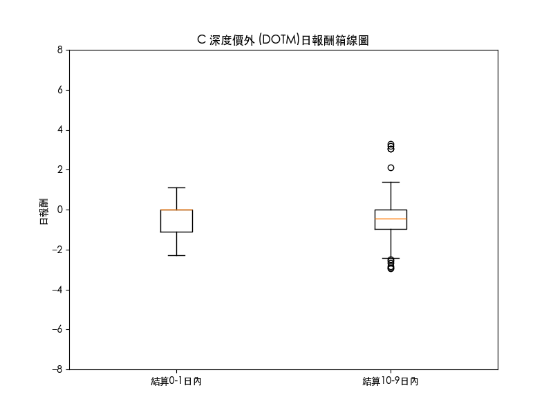
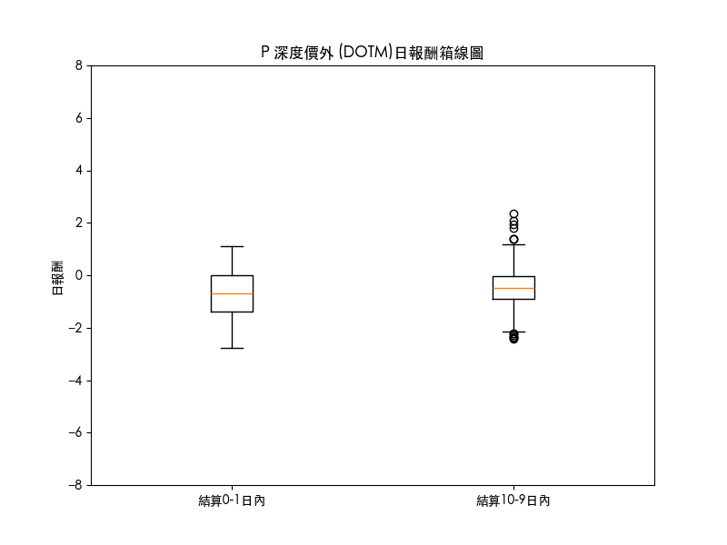

## C 深度價內 (DITM)

            - 結算0-1日內年化波動: 2.07981673856765

            - 結算2-9日內年化波動: 2.511578734446783

            - 結算0-1日內自由度: 126

            - 結算2-9日內自由度: 562

            - f值: 0.685735358939439

            - p值: 0.9948666340791196

            - alpha值: 0.05

- **結論**: 年化波動不存在顯著差異

## C 價內 (ITM)

            - 結算0-1日內年化波動: 6.484083625928592

            - 結算2-9日內年化波動: 5.623935003916583

            - 結算0-1日內自由度: 103

            - 結算2-9日內自由度: 472

            - f值: 1.329280484932998

            - p值: 0.026344336403490654

            - alpha值: 0.05

- **結論**: 年化波動存在顯著差異

## C 價平 (ATM)

            - 結算0-1日內年化波動: 42.95137107414853

            - 結算2-9日內年化波動: 10.663344904810083

            - 結算0-1日內自由度: 100

            - 結算2-9日內自由度: 492

            - f值: 16.224344157623875

            - p值: 1.1102230246251565e-16

            - alpha值: 0.05

- **結論**: 年化波動存在顯著差異

## C 價外 (OTM)

            - 結算0-1日內年化波動: 27.952115564404004

            - 結算2-9日內年化波動: 15.508379386378692

            - 結算0-1日內自由度: 93

            - 結算2-9日內自由度: 438

            - f值: 3.2486021908290903

            - p值: 1.1102230246251565e-16

            - alpha值: 0.05

- **結論**: 年化波動存在顯著差異

## C 深度價外 (DOTM)

            - 結算0-1日內年化波動: 11.73613974748238

            - 結算2-9日內年化波動: 13.918930023699014

            - 結算0-1日內自由度: 94

            - 結算2-9日內自由度: 462

            - f值: 0.7109496446556758

            - p值: 0.9780154352821665

            - alpha值: 0.05

- **結論**: 年化波動不存在顯著差異

## P 深度價內 (DITM)

            - 結算0-1日內年化波動: 1.3724393190132198

            - 結算2-9日內年化波動: 3.122103823399105

            - 結算0-1日內自由度: 94

            - 結算2-9日內自由度: 462

            - f值: 0.19323759383174072

            - p值: 1.0

            - alpha值: 0.05

- **結論**: 年化波動不存在顯著差異

## P 價內 (ITM)

            - 結算0-1日內年化波動: 4.821186546419013

            - 結算2-9日內年化波動: 5.365654627315797

            - 結算0-1日內自由度: 93

            - 結算2-9日內自由度: 438

            - f值: 0.8073511016664843

            - p值: 0.8958130791077958

            - alpha值: 0.05

- **結論**: 年化波動不存在顯著差異

## P 價平 (ATM)

            - 結算0-1日內年化波動: 40.43000255304155

            - 結算2-9日內年化波動: 9.195158555536873

            - 結算0-1日內自由度: 100

            - 結算2-9日內自由度: 492

            - f值: 19.33254780827596

            - p值: 1.1102230246251565e-16

            - alpha值: 0.05

- **結論**: 年化波動存在顯著差異

## P 價外 (OTM)

            - 結算0-1日內年化波動: 21.64743537784381

            - 結算2-9日內年化波動: 13.08436254935542

            - 結算0-1日內自由度: 103

            - 結算2-9日內自由度: 472

            - f值: 2.737207775993298

            - p值: 2.2326585025211898e-13

            - alpha值: 0.05

- **結論**: 年化波動存在顯著差異

## P 深度價外 (DOTM)

            - 結算0-1日內年化波動: 13.170553575502609

            - 結算2-9日內年化波動: 11.1030232035565

            - 結算0-1日內自由度: 126

            - 結算2-9日內自由度: 562

            - f值: 1.4071019463525734

            - p值: 0.005163376762167715

            - alpha值: 0.05

- **結論**: 年化波動存在顯著差異

