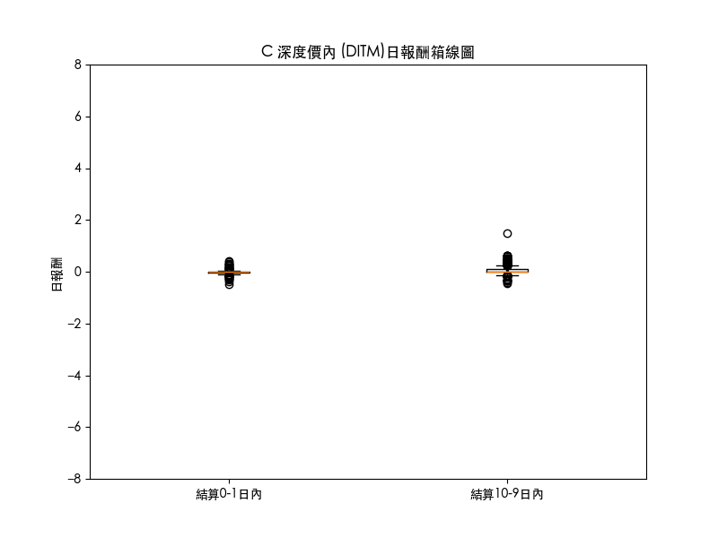
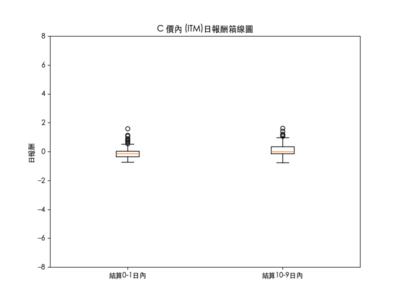
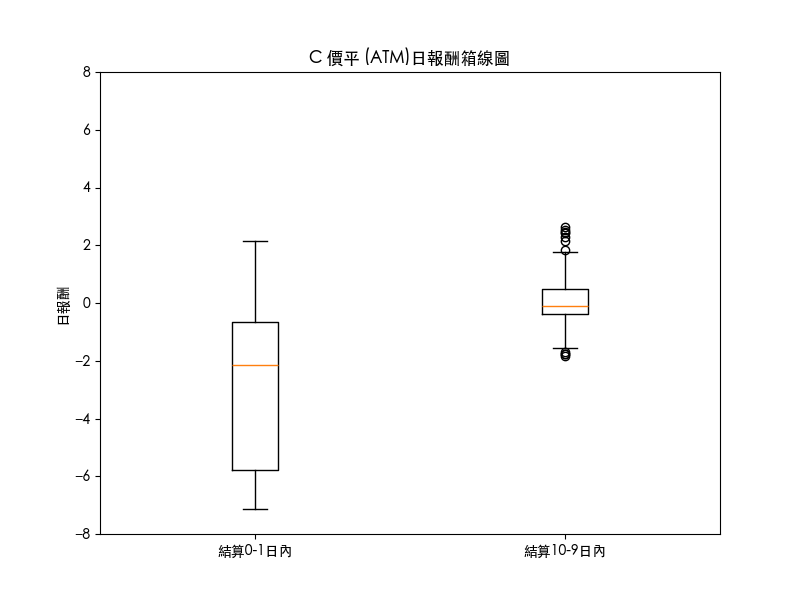
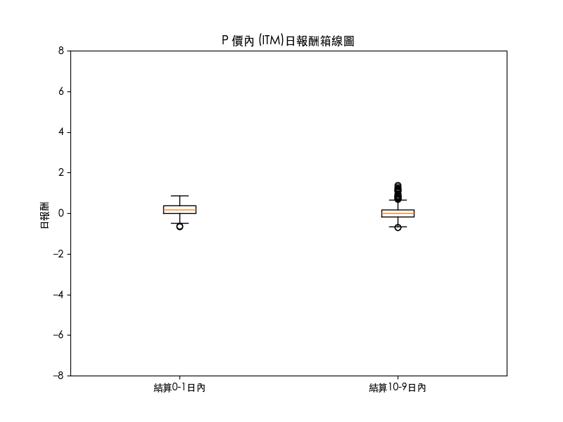
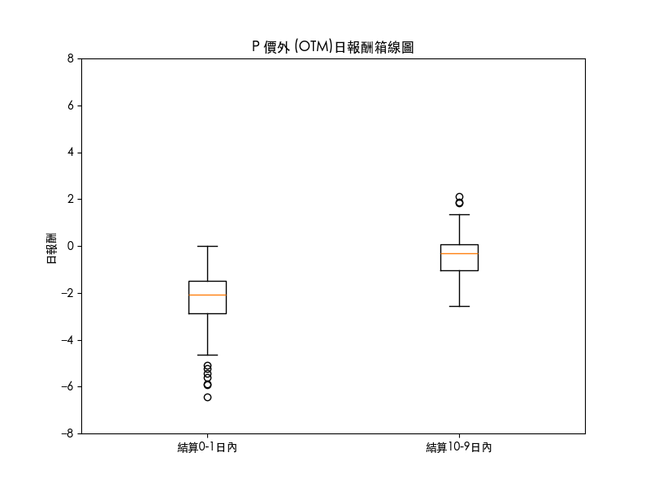

## C 深度價內 (DITM)

            - 結算2日內波動率: 0.34218

            - 結算10日內波動率(不含2日內): 0.41755

            - 結算1日內自由度: 251

            - 結算9日內自由度(不含2日內): 455

            - f值: 0.8195

            - p值: 0.96079

            - alpha值: 0.05

- **結論**: 波率不存在顯著差異

## C 價內 (ITM)

            - 結算2日內波動率: 3.04794

            - 結算10日內波動率(不含2日內): 1.69573

            - 結算1日內自由度: 203

            - 結算9日內自由度(不含2日內): 385

            - f值: 1.79742

            - p值: 0.0

            - alpha值: 0.05

- **結論**: 波率存在顯著差異

## C 價平 (ATM)

            - 結算2日內波動率: 100.8841

            - 結算10日內波動率(不含2日內): 5.1357

            - 結算1日內自由度: 199

            - 結算9日內自由度(不含2日內): 403

            - f值: 19.64367

            - p值: 0.0

            - alpha值: 0.05

- **結論**: 波率存在顯著差異

## C 價外 (OTM)

            - 結算2日內波動率: 43.77707

            - 結算10日內波動率(不含2日內): 10.42978

            - 結算1日內自由度: 184

            - 結算9日內自由度(不含2日內): 359

            - f值: 4.19731

            - p值: 0.0

            - alpha值: 0.05

- **結論**: 波率存在顯著差異

## C 深度價外 (DOTM)

            - 結算2日內波動率: 10.77046

            - 結算10日內波動率(不含2日內): 11.93429

            - 結算1日內自由度: 183

            - 結算9日內自由度(不含2日內): 389

            - f值: 0.90248

            - p值: 0.78475

            - alpha值: 0.05

- **結論**: 波率不存在顯著差異

## P 深度價內 (DITM)

            - 結算2日內波動率: 0.51414

            - 結算10日內波動率(不含2日內): 0.53037

            - 結算1日內自由度: 183

            - 結算9日內自由度(不含2日內): 389

            - f值: 0.9694

            - p值: 0.59066

            - alpha值: 0.05

- **結論**: 波率不存在顯著差異

## P 價內 (ITM)

            - 結算2日內波動率: 2.16265

            - 結算10日內波動率(不含2日內): 1.56421

            - 結算1日內自由度: 184

            - 結算9日內自由度(不含2日內): 359

            - f值: 1.38258

            - p值: 0.00498

            - alpha值: 0.05

- **結論**: 波率存在顯著差異

## P 價平 (ATM)

            - 結算2日內波動率: 70.63206

            - 結算10日內波動率(不含2日內): 3.96204

            - 結算1日內自由度: 199

            - 結算9日內自由度(不含2日內): 403

            - f值: 17.82718

            - p值: 0.0

            - alpha值: 0.05

- **結論**: 波率存在顯著差異

## P 價外 (OTM)

            - 結算2日內波動率: 31.03698

            - 結算10日內波動率(不含2日內): 7.51062

            - 結算1日內自由度: 203

            - 結算9日內自由度(不含2日內): 385

            - f值: 4.13241

            - p值: 0.0

            - alpha值: 0.05

- **結論**: 波率存在顯著差異

## P 深度價外 (DOTM)

            - 結算2日內波動率: 8.98488

            - 結算10日內波動率(不含2日內): 6.85856

            - 結算1日內自由度: 251

            - 結算9日內自由度(不含2日內): 455

            - f值: 1.31002

            - p值: 0.00683

            - alpha值: 0.05

- **結論**: 波率存在顯著差異

